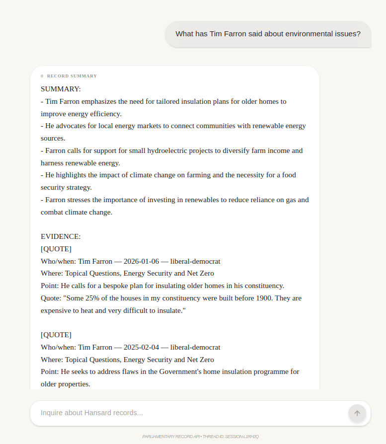
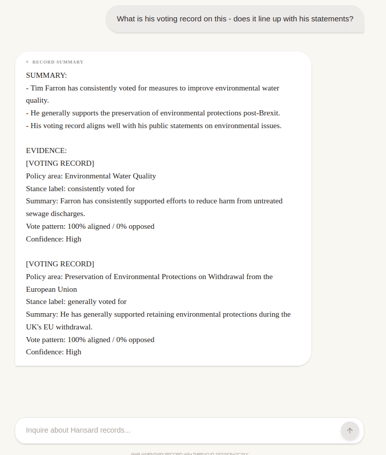

# OpenChambers

An AI-powered research assistant for UK parliamentary debates. Query Hansard records using natural language, explore MP voting patterns, and surface evidence from parliamentary proceedings with semantic search.

## Overview

OpenChambers combines semantic search with a conversational LLM interface to make UK parliamentary records accessible and queryable. The system ingests Hansard debate transcripts, generates vector embeddings for semantic retrieval, and provides an agentic chatbot that can search debates, look up MPs and analyze voting records.

**What's inside:**

- **Hybrid retrieval pipeline**: Transforms raw parliamentary XML into chunked, embedded documents with context-aware preprocessing (question/answer detection, speaker attribution and hierarchical topic tracking). Retrieval combines vector similarity (pgvector HNSW) with BM25 lexical search (pg_textsearch), fused via Reciprocal Rank Fusion
- **Deterministic RAG pipeline**: LangGraph-based pipeline (Classify → Resolve → Retrieve → Generate) that interprets queries, resolves entities, searches and synthesizes evidence
- **Production patterns**: Streaming responses, conversation persistence, resumable batch processing and efficient indexing with pgvector HNSW and BM25

## What you can ask

- *"Please compare Labour and Tory views on immigration"*
  - Follow up: *"What about other parties?"*
- *"What has David Davis been talking about recently?"*
- *"What has Tim Farron said about environmental issues?"*
  - Follow up: *"What is his voting record on this - does it line up with his statements?*"
- *"What has been said about NHS waiting times in the past month?"*

The agent provides a summary to answer the user's question based on retrieved hansard utterances in addition to citing sources with dates, speakers and their party at the time. It can also cross-reference voting records with stated positions.







## Key features

| Feature | Description |
|---------|-------------|
| **Chatbot agent** | LangGraph pipeline classifies intent, resolves entities, runs targeted searches and synthesises results |
| **Hybrid search** | Vector similarity (pgvector HNSW) and BM25 lexical search (pg_textsearch) fused with Reciprocal Rank Fusion for robust retrieval across semantic and keyword queries |
| **Structured filtering** | Automatically applies filters by party, speaker, date range and resolves MP name ambiguity with user help |
| **Voting record analysis** | Query MP voting patterns across policy areas |
| **Context preservation** | Tracks debate hierarchy (oral heading → department → topic) and links answers to their triggering questions/statements |
| **Streaming chat** | Real-time token streaming via Server-Sent Events for responsive UX |
| **Conversation memory** | PostgreSQL-backed conversation persistence across sessions |
| **Resumable pipelines** | Checkpoint-based batch processing for large-scale data ingestion |

## Architecture

```
┌─────────────────────────────────────────────────────────────┐
│                   Frontend (Next.js)                        │
│              Chat UI with SSE streaming                     │
└─────────────────────────┬───────────────────────────────────┘
                          │ HTTP/SSE
┌─────────────────────────▼───────────────────────────────────┐
│                   FastAPI Backend                           │
│  ┌────────────────────────────────────────────────────────┐ │
│  │            LangGraph Pipeline                          │ │
│  │  ┌──────────┐  ┌─────────┐  ┌──────────┐  ┌──────────┐ │ │
│  │  │ Classify │→ │ Resolve │→ │ Retrieve │→ │ Generate │ │ │
│  │  │  (LLM)   │  │(lookup) │  │ (search) │  │  (LLM)   │ │ │
│  │  └──────────┘  └───┬─────┘  └─────┬────┘  └──────────┘ │ │
│  └────────────────────┼──────────────┼────────────────────┘ │
└──────────────────────────────────────┼──────────────────────┘
                        │              │
┌───────────────────────▼──────────────▼──────────────────────┐
│              PostgreSQL + pgvector + pg_textsearch          │
│  ┌────────────┐ ┌──────────┐ ┌────────┐ ┌────────────────┐  │
│  │ utterances │ │embeddings│ │ people │ │ voting_records │  │
│  │  + chunks  │ │(HNSW+BM25│ │        │ │                │  │
│  └────────────┘ └──────────┘ └────────┘ └────────────────┘  │
└─────────────────────────────────────────────────────────────┘
```

**Data flow:**
1. XML debates → Parse & extract utterances with context
2. Utterances → Summarize context (if long) → Format with metadata → Chunk with overlap
3. Chunks → Generate embeddings (sentence-transformers) → Store in pgvector
4. Query → Vector search (HNSW) + BM25 lexical search → Reciprocal Rank Fusion → Filter → Return to agent → Synthesize response

## Repository structure

```
openchambers/
├── backend/
│   ├── src/
│   │   ├── api/              # FastAPI application and endpoints
│   │   ├── chatbot/          # LangGraph agent, tools, and prompts
│   │   └── data/
│   │       ├── database/     # SQLAlchemy models and repositories
│   │       ├── loaders/      # XML and metadata parsers
│   │       ├── pipelines/    # Batch ingestion orchestration
│   │       └── transformers/ # Summarization, formatting, chunking
│   ├── scripts/              # CLI scripts for data ingestion
│   └── data/                 # Raw data directory
│       └── hansard/
│           ├── debates/      # TheyWorkForYou XML files
│           └── metadata/     # People, votes, policies
├── frontend/                 # Next.js chat interface
└── README.md
```

## Quickstart

### Prerequisites

- [Docker](https://docs.docker.com/get-docker/) and Docker Compose
- OpenAI API key

### 1. Configure environment

```bash
cp .env.example .env
```

Edit `.env` with your OpenAI key:
```
OPENAI_API_KEY=sk-...
```

### 2. Start the application

```bash
docker compose up
```

This starts PostgreSQL (with pgvector and pg_textsearch), the FastAPI backend and the Next.js frontend. Visit `http://localhost:3000` once all services are ready.

### 3. Download data

**Hansard debates** (example for January 2026):
```bash
rsync -az --progress --exclude '.svn' --exclude 'tmp/' \
  data.theyworkforyou.com::parldata/scrapedxml/debates/debates2026-01* \
  backend/data/hansard/debates/
```

**Metadata files:**
```bash
curl -L -o backend/data/hansard/metadata/people.json \
  https://raw.githubusercontent.com/mysociety/parlparse/master/members/people.json

curl -L -o backend/data/hansard/metadata/divisions.parquet \
  https://votes.theyworkforyou.com/static/data/divisions.parquet

curl -L -o backend/data/hansard/metadata/votes.parquet \
  https://votes.theyworkforyou.com/static/data/votes.parquet

curl -L -o backend/data/hansard/metadata/policy_calc_to_load.parquet \
  https://votes.theyworkforyou.com/static/data/policy_calc_to_load.parquet

curl -L -o backend/data/hansard/metadata/policies.json \
  https://votes.theyworkforyou.com/policies.json
```

### 4. Ingest data

```bash
# Process debates from 2025-01-01 onwards (default)
docker compose exec backend python3 -m scripts.add_debates_to_db

# Process a specific date range
docker compose exec backend python3 -m scripts.add_debates_to_db --start-date 2024-01-01 --end-date 2024-12-31

# Drop all tables and reingest from scratch (clears checkpoint; preserves summariser cache)
docker compose exec backend python3 -m scripts.add_debates_to_db --reset

# Clear the LLM summariser cache (forces re-summarisation of long statements)
docker compose exec backend python3 -m scripts.add_debates_to_db --clear-cache

# Load metadata (people, votes, policies) — run after debates are ingested
docker compose exec backend python3 -m scripts.add_metadata_to_db
```

Checkpointing is in place which avoids duplicate records when re-running the scripts.

### Development

Source files are bind-mounted into the containers — editing any Python file triggers an automatic uvicorn reload, and frontend changes are picked up by Next.js hot reload. No need to restart containers.

```bash
# Run tests
docker compose exec backend python3 -m pytest -v

# Access the database
docker compose exec db psql -U hansard_user -d hansard
```

Database data persists across restarts in a Docker volume. To reset everything: `docker compose down -v`.

## Tech stack

| Layer | Technologies |
|-------|-------------|
| **Frontend** | Next.js 16, React 19, TypeScript, Tailwind CSS |
| **API** | FastAPI, Server-Sent Events, Pydantic |
| **Agent** | LangGraph, LangChain, OpenAI gpt-4o-mini + gpt-4.1-nano |
| **Embeddings** | sentence-transformers (multi-qa-MiniLM-L6-cos-v1) |
| **Database** | PostgreSQL, pgvector (HNSW), pg_textsearch (BM25), SQLAlchemy |
| **Data processing** | Pandas, PyArrow, lxml |

## Data sources

This project uses open data from:

- **[TheyWorkForYou](https://www.theyworkforyou.com/)** — Hansard debate transcripts in XML format
- **[mySociety parlparse](https://github.com/mysociety/parlparse)** — MP biographical data
- **[TheyWorkForYou Votes](https://votes.theyworkforyou.com/)** — Voting records

All data is made available under open licenses by these organizations. This project is not affiliated with TheyWorkForYou or mySociety.

## Future improvements
- Formalise evaluation: build a small labelled query set and measure retrieval quality (Precision@k / Recall@k / nDCG).
- Reduce retrieval-led hallucinations: tune similarity thresholds and add a reranking step (cross-encoder or LLM-judge) prior to generation.
- Context management: cap and/or summarise chat history and retrieved context to stay within token limits.

## License

MIT

## Contact

- GitHub: [@Jamie-Holding](https://github.com/Jamie-Holding)
- LinkedIn: [Jamie Holding](https://www.linkedin.com/in/jamie-holding/)
